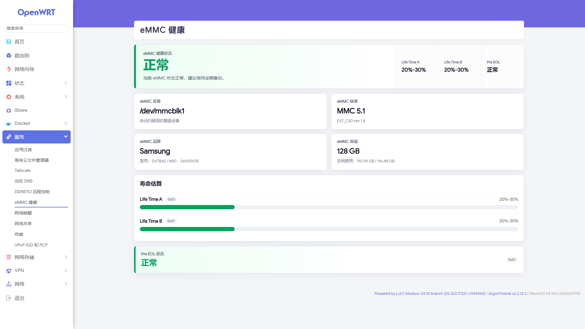

# eMMC-Health

<p align="center">
  
</p>

<h3 align="center">eMMC 健康状态 LuCI 插件</h3>

<p align="center">
  面向 <strong>iStoreOS / OpenWrt</strong> 的eMMC健康检测工具，用于图形化查看品牌、容量、寿命估算和Pre EOL状态。
</p>

<p align="center">
  
  
  
  
  
</p>

---

## 项目简介

`eMMC-Health` 是一个用于 **iStoreOS / OpenWrt** 的 LuCI 插件。  
它可以自动检测设备上的 eMMC 存储，并在 LuCI 页面中展示 eMMC 的健康状态、品牌信息、容量、空间使用情况、MMC 标准、EXT_CSD 寿命估算和 Pre EOL 状态。

适合用于软路由、开发板、工控机、NAS 小主机等使用 eMMC 存储的设备。

---

## 界面预览

<p align="center">
  
</p>

---

## 命名说明

| 项目 | 名称 |
| --- | --- |
| 仓库 / 项目名 | `eMMC-Health` |
| LuCI 中文菜单名 | `eMMC 健康` |
| LuCI 英文菜单名 | `eMMC Health` |
| OpenWrt 包名 | `luci-app-emmc-health` |

---

## 功能特性

- 自动检测整盘 eMMC 设备，例如 `/dev/mmcblk0`
- 自动过滤分区和特殊区域，例如 `/dev/mmcblk0p1`、`/dev/mmcblk0boot0`、`/dev/mmcblk0rpmb`
- 识别 eMMC 品牌、型号和 MID
- 显示标称容量，例如 `128 GB`
- 显示实际空间使用情况，并保留两位小数
- 显示 MMC 标准和 EXT_CSD Revision
- 解析并展示：
  - `Life Time A`
  - `Life Time B`
  - `Pre EOL`
- `mmc-utils` 不可用时，可回退到 `sysfs` / `debugfs`
- 安装后自动尝试补装 `mmc-utils`
- 提供清晰的中文状态说明，便于判断 eMMC 健康情况

---

## LuCI 入口

安装完成后，在 LuCI 后台进入：

```text
服务 -> eMMC 健康
```

即可查看当前设备的 eMMC 健康状态。

---

## 目录结构

```text
eMMC-Health/
├── Makefile
├── README.md
├── logo.png
├── Screenshot.png
├── htdocs/
│   └── luci-static/
│       └── resources/
│           └── view/
│               └── emmc-health.js
├── root/
│   └── usr/
│       ├── libexec/
│       │   ├── emmc-health
│       │   └── emmc-health-install-mmc
│       └── share/
│           ├── luci/
│           │   └── menu.d/
│           │       └── luci-app-emmc-health.json
│           └── rpcd/
│               └── acl.d/
│                   └── luci-app-emmc-health.json
└── tools/
```

---

## 标准 OpenWrt / iStoreOS 编译方式

仓库根目录的 `Makefile` 为标准 LuCI 包格式，可以直接放入 OpenWrt / iStoreOS 源码树中编译。

```sh
cp -r eMMC-Health /path/to/openwrt/package/luci-app-emmc-health
cd /path/to/openwrt
make menuconfig
make package/luci-app-emmc-health/compile V=s
```

在 `menuconfig` 中选择：

```text
LuCI -> Applications -> luci-app-emmc-health
```

---

## 本仓库本地打包

如果只是需要从当前仓库直接生成 `.ipk`，可以执行：

```sh
python tools/build-ipk.py all
```

生成文件位于：

```text
dist/luci-app-emmc-health_1.1.2-r1_all.ipk
```

---

## 安装方法

将生成的 `.ipk` 上传到 iStoreOS / OpenWrt 设备后执行：

```sh
opkg install luci-app-emmc-health_*.ipk
/etc/init.d/rpcd restart
/etc/init.d/uhttpd restart
```

如果 `mmc-utils` 未自动安装，可以手动安装：

```sh
opkg update
opkg install mmc-utils
```

---

## 依赖说明

### 必需依赖

- `luci-base`
- `luci-js-deps`
- `rpcd`

### 可选依赖

- `mmc-utils`

安装后 helper 会自动尝试执行：

```sh
opkg update
opkg install mmc-utils
```

`mmc-utils` 可用于读取更完整的 EXT_CSD 信息。  
当 `mmc-utils` 不可用时，插件会尽量从 `sysfs` / `debugfs` 获取可用信息。

---

## 容量与空间显示规则

| 项目 | 说明 |
| --- | --- |
| 主卡片容量 | 显示标准档位，例如 `128 GB` |
| 空间使用 - 已使用 | 来自实际文件系统统计 |
| 空间使用 - 总容量 | 使用整盘大小口径，与磁盘管理工具保持一致 |
| 小数位 | 保留两位小数 |

---

## 品牌识别

品牌识别基于 eMMC `MID` 映射，当前已覆盖以下厂商：

<table>
  <tr>
    <td>Panasonic</td>
    <td>Kingston</td>
    <td>Toshiba / Kioxia</td>
  </tr>
  <tr>
    <td>SanDisk / Western Digital</td>
    <td>Fujitsu</td>
    <td>ATP</td>
  </tr>
  <tr>
    <td>Macronix</td>
    <td>Winbond</td>
    <td>Phison</td>
  </tr>
  <tr>
    <td>SMI / Silicon Motion</td>
    <td>NEC / Renesas</td>
    <td>GigaStone</td>
  </tr>
  <tr>
    <td>Micron / Numonyx</td>
    <td>Samsung</td>
    <td>Apacer</td>
  </tr>
  <tr>
    <td>BIWIN</td>
    <td>GigaDevice</td>
    <td>MMY / Macronix Micro</td>
  </tr>
  <tr>
    <td>Raysun</td>
    <td>Comay</td>
    <td>KingMax</td>
  </tr>
  <tr>
    <td>Swissbit</td>
    <td>FORESEE / Longsys</td>
    <td>SK Hynix</td>
  </tr>
  <tr>
    <td>YMTC</td>
    <td></td>
    <td></td>
  </tr>
</table>

---

## 健康状态说明

| 项目 | 说明 |
| --- | --- |
| Life Time A | 通常表示 eMMC 内部某类存储区域的寿命估算 |
| Life Time B | 通常表示另一类存储区域的寿命估算 |
| Pre EOL | eMMC 预寿命终止状态，用于提示设备是否接近寿命末期 |
| EXT_CSD rev | eMMC 扩展 CSD 版本 |
| MMC 版本 | eMMC 标准版本，例如 `MMC 5.1` |

> 不同厂商对 eMMC 内部区域的定义可能存在差异，因此页面显示结果应作为健康状态参考。重要数据请定期备份。

---

## 版本

当前版本：

```text
1.1.2
```

---

## License

本项目使用：

```text
GPL-3.0-only
```
